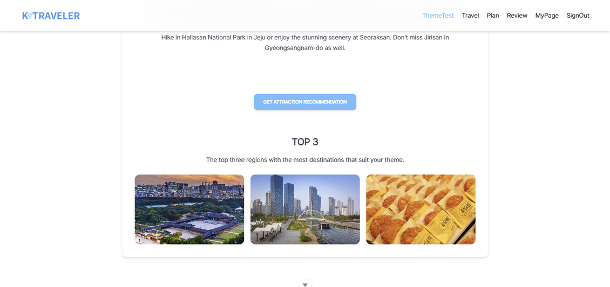

# ✈️ K-Traveler

# 프로젝트 소개


외래 관광객을 위한 한국 관광지 추천 서비스

> 본 사이트는 `여행 테마 테스트`를 통해 여행객의 `여행 선호도`를 파악하고, 분류된 테마에 따라 `맞춤형 관광지`를 추천합니다.
> 추천된 관광지를 가이드로 하여금, 외래 관광객이 한국 여행에 대한 계획을 수월하게 세울 수 있도록 돕습니다.

<br>

# 기획 의도

```
외래 관광객은 국내 여행을 떠나는 한국인과 달리, 한국에 대한 사전 정보가 없습니다. 그들은 계획을 세우기 앞서, 어떤 것부터 알아봐야할 지 막막해 합니다.
그럼에도 직접 여행 계획을 세우기 위해 여행 사이트를 방문하는 여행객은, 본인만의 특색있는 여행을 떠나고 싶은 여행객이라 판단했습니다.
여행 테마 테스트를 통해 여행객의 여행 선호도를 파악하고, 분류된 테마에 따라, 맞춤형 관광지를 추천합니다. 추천된 관광지를 가이드로 하여금, 외래 관광객이 한국 여행에 대한 계획을 수월하게 세울 수 있도록 돕게 하고자 기획 되었습니다.
```

<br>

---

# 문서

| 기획/디자인                                                                                                                                                                                        | ERD                                                   | 작업록                                                                                                                    | 문서                                                                                                                          | 리팩토링                                                                                                  |
| -------------------------------------------------------------------------------------------------------------------------------------------------------------------------------------------------- | ----------------------------------------------------- | ------------------------------------------------------------------------------------------------------------------------- | ----------------------------------------------------------------------------------------------------------------------------- | --------------------------------------------------------------------------------------------------------- |
| [🎨기획/디자인](https://www.figma.com/design/q4wSnsEX1NBRHRxGLdanwh/%EC%96%B4%EC%84%9C%EC%99%80-%ED%95%9C%EA%B5%AD%EC%9D%80-%EC%B2%98%EC%9D%8C%EC%9D%B4%EC%A7%80?node-id=0-1&t=E7wMpTYvwAUo8BNz-1) | [⚡ERD](https://www.erdcloud.com/d/GxTNeS8AxmjZa7Wbn) | [📝작업록](https://crystalline-larch-eb2.notion.site/9cddd4769e0a4bcaaa84832dc2808008?v=310fe8c0f78045308abf3b1d9aa5af41) | [📜문서](https://crystalline-larch-eb2.notion.site/75f807b5af9e4148ad50d2cd3a6aa62d?v=ac2be13221bf4aacab7ed677b84aa869&pvs=4) | [🛠️리팩토링](https://github.com/First-Time-Korea/K-Traveler-BE/wiki/%EB%A6%AC%ED%8C%A9%ED%86%A0%EB%A7%81) |

<br>

---

# 프로젝트 소개 및 주요 기능

## 📌JWT 토큰을 이용한 회원가입/로그인


<br> 
회원가입 시 아이디 중복 체크 및 유효성 검사를 진행했습니다.


<br> 
로그인 입니다.

<br>

## 📌테마 테스트


<br> 
8개의 테마에 해당하는 질문을 각각 4가지 선정하여, 
<br>사용자의 선택에 따른 가중치 연산 후, 결과를 도출했습니다.

<br>

## 📌테스트 결과에 따른 여행지 추천


<br> 
테마 유형과 설명 화면입니다.


<br> 
결과 테마에 해당하는 관광지가 많은 지역, TOP3를 추천해 줍니다.


<br> 
로그인된 사용자에 한하여, 실제 관광지 추천 페이지로 이동 할 수 있습니다.
<br>
이 때, 본인의 테마에 해당하는 맞춤형 관광지 주천 받을 수 있습니다.

<br>

## 📌여행지 검색 및 북마크


<br> 
테마 및 카테고리, 지역에 따라, 커스텀 검색도 가능합니다. 
<br>
결과는 지도에 클러스터링 되어 보여집니다.


<br> 
마음에 드는 관광지가 있다면, 북마크 기능을 통해 추후 여행 계획에 참조 할 수 있습니다.

<br>

## 📌여행 계획


<br> 
여행 지역을 선택합니다. 
<br> 여행 계획 수립 시, 관광지는 해당 지역을 바탕으로 리스트 됩니다.


<br> 
여행 일정을 선택합니다.


<br> 
하루 간격으로 계획을 수립할 수 있습니다.
<br> 
이 때, 초기 지역 뿐 아니라, 북마크한 장소 및 타 지역도 계획에 반영 가능합니다.
<br> 
외래 관광객은 한 지역만 방문하는 경우가 희귀하기 때문입니다.


<br> 
썸네일과 제목을 등록하며 여행 계획 수립이 완료됩니다.

<br>

## 📌마이 페이지


<br> 
북마크한 장소를 확인할 수 있습니다.


<br> 
여행 계획 목록을 확인할 수 있습니다.


<br> 
여행 계획 상세 화면입니다.

<br>

## 📌여행 후기 공유 게시판


<br> 
게시글은 Tag에 기반해 검색, 작성 할 수 있습니다.

<br> 
게시글은 댓글과 대댓글이 가능합니다.

<br>

## 📌GPT 3.5를 통한 한영 번역


<br>
한글 데이터로 제공된 K-Culture 관련 관광지는 GPT API를 사용해 번역 되었습니다.

<br>

---

# 기술 스택

<br>

[//]: # "---"
[//]: # "## 기술적 도전"

---

# 아키텍처

---

<table>
 <tr>
    <td align="center"><b>팀원</b></a></td>
    <td align="center">어떤 팀원이었나요❓</td>
 </tr>
 <tr>
  <td align="center"><a href="https://github.com/seminss"><br>seminss</a></td>
  <td></td>
  </tr>
 
  <tr>
  <td align="center"><a href="https://github.com/jiwon718"><br>jiwon</a></td>
  <td></td>
  </tr>
<br>
